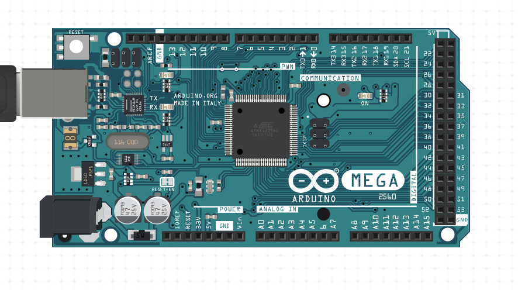
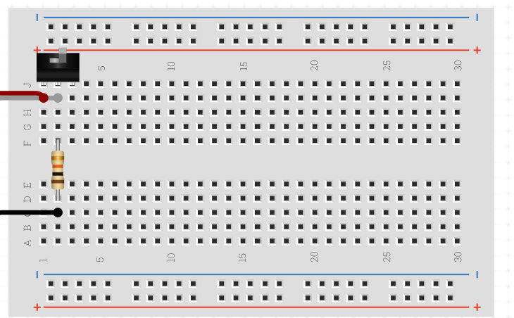
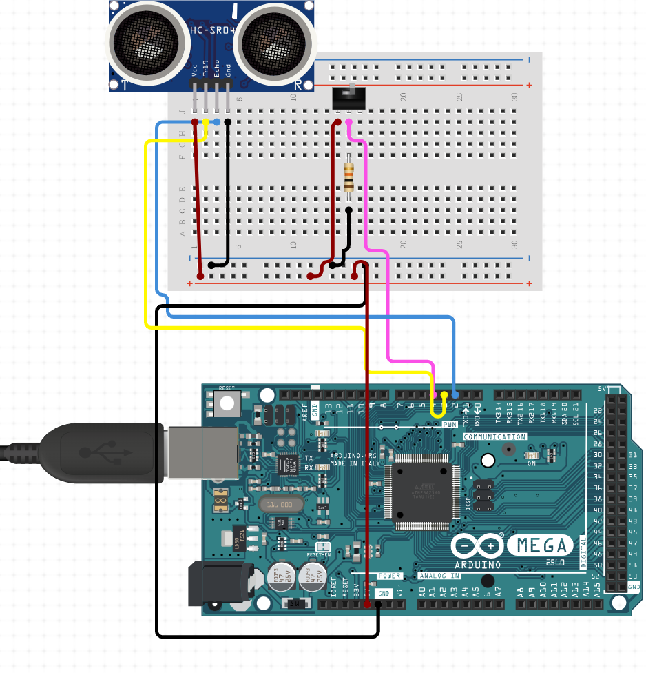
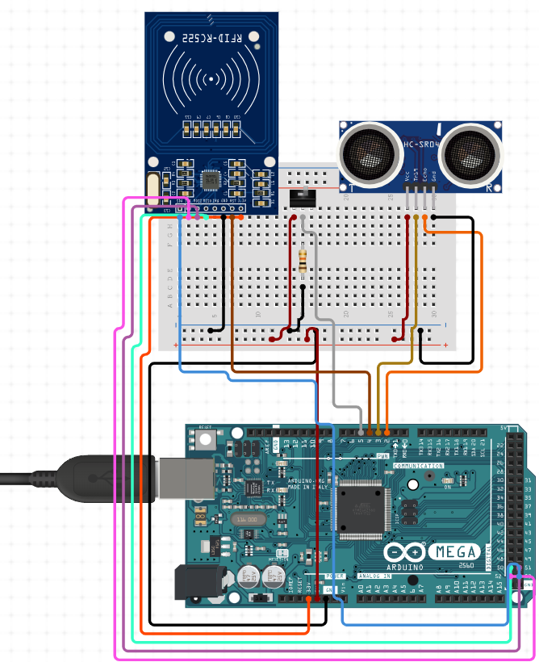
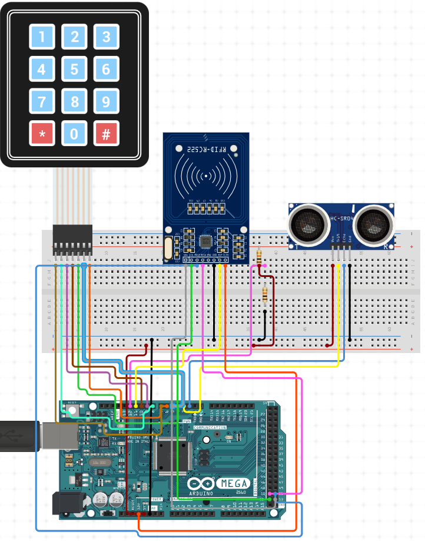
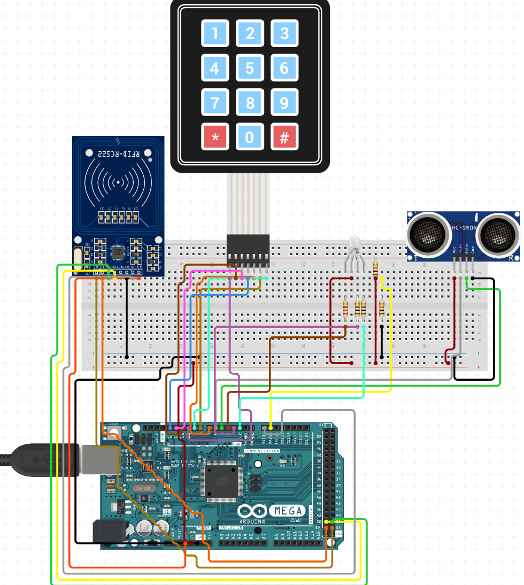

# mbayet.github.io
# Introduction

My name is Mbaye Toure ,and I am going to be a sophmore next year at wisdom Highschool in HTX . This summer I made a ultrasonic security system. My ultasonic security system how does it work and what does it do ? well let me tell you. 

 
# ultrasonic security system 
My ultrasonic system it detects how close someone is to my sensor when that hapens my light will turn off showing that it is detecting something, and if you are trying to access it you will have to put in the pasword and scan my rfid card.

# Arduino Mega 2560 R3
In this project I started by having my Arduino Mega 2560 R3 you guys are wondering how does it work well let me explain.The Arduino Mega 2560  R3 is what I like to call the brain,because it is basicly like a motherboard where everything is controlled,and where you connect your power .  

# Breadboard
After already having your arduino mega you will need a breadboard.A breadboard is where you can allow allow easy and quick creation of temporary electronic circuits or to carry out experiments with circuit.

# ultrasonic sensor
What is an ultrasonic sensor? An ultrasonic sensor is a sensor that  measures the distance to an object using ultrasonic sound waves. The first step you have to do to connect your sensor is that you have to know what a vcc,trig pin,echo pin,and  ground are. A vcc is the first needle that you will connect to a 5 volt then you can connect your echo pin, and trig pin wich are digital pins so you can conect them to any digital pin that you want. After you finish the trig and the echo you can proceed to connect  your ground because if don't connect your ground your sensor will not have power. I will put a picture so you guys can see how your sensor should look after you connect it.

# RFID
What is an RFID? An RFID is used to  to passively identify a tagged object. The way you can connect your rfid is that ther will be letters writen on your rfid and some of them will be digital pins then you will have to connect a 3.3 volt, and your ground because you need your ground for the rfid to work.
Here is a picture you can use so you can connect your rfid.

# Keypad
What is a keypad? A keypad is like a mini keyboard with numbers and a couple of letters.The wsy you can connect your keypad is that there is eight dgital pin that you will need to connect to the first four will be for the rows and the last four will be for coloms. One thing is that it does not matter where you plug your digital pins .
Here is a picture so you guys can see how I connected mine.

                                                 
  # RGB
What is an RGB? An RGB  emits different colors by mixing the 3 basic colors red, green and blue. The way you can connect your RGB is that you can connect it to your breadboard anywhere you want , but the is four needles and one of the needls is longer than the other one that needle is called a cathode then for the other three wires you can use resistors. For those who don't know what a resistor is I will talk about it in the next section .
Here is a picture so you guys can see how it looks after you connect your RGB .

# Resistors 
What is a resistor? A resistor reduces current flow, adjust signal levels, to divide voltages, bias active elements, and terminate transmission lines, among other uses. Another thing that you guys need to know is that there are two types namely linear resistor and non-linear resistor.
Here is a picture of how  a resistor look .

  # CODE

# tools

you can use this link to buy an arduino kit so you can make this project.

[here](https://www.amazon.com/EL-KIT-008-Project-Complete-Ultimate-TUTORIAL/dp/B01EWNUUUA/ref=asc_df_B01EWNUUUA/?tag=hyprod-20&linkCode=df0&hvadid=309779531175&hvpos=&hvnetw=g&hvrand=12878185721675954885&hvpone=&hvptwo=&hvqmt=&hvdev=c&hvdvcmdl=&hvlocint=&hvlocphy=9033313&hvtargid=pla-587465714317&psc=1&tag=&ref=&adgrpid=62412137260&hvpone=&hvptwo=&hvadid=309779531175&hvpos=&hvnetw=g&hvrand=12878185721675954885&hvqmt=&hvdev=c&hvdvcmdl=&hvlocint=&hvlocphy=9033313&hvtargid=pla-587465714317)

  # video
 

 [here](https://youtu.be/nvRi3Jw5EbE)

  # items 

 