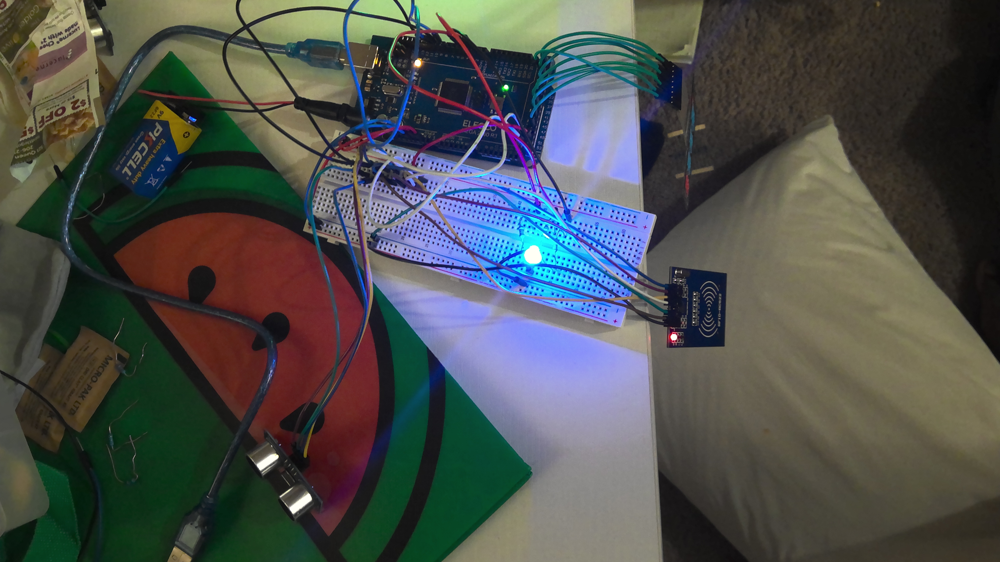

# mbayet.github.io
My name is Mbaye Toure ,and I am going to be a sophmore next year at wisdom Highschool in HTX . This summer I made a ultrasonic security system. My ultasonic security system how does it work and what does it do ? well let me tell you. My ultrasonic system it detects how close someone is to my sensor when that hapen my light will turn off showing that it is detecting something, and if you are trying to access it you will have to put in the pasword and scan my rfid card.
I am going to Show you a picture of my system then I will tell how evrything works, and how I did it .
