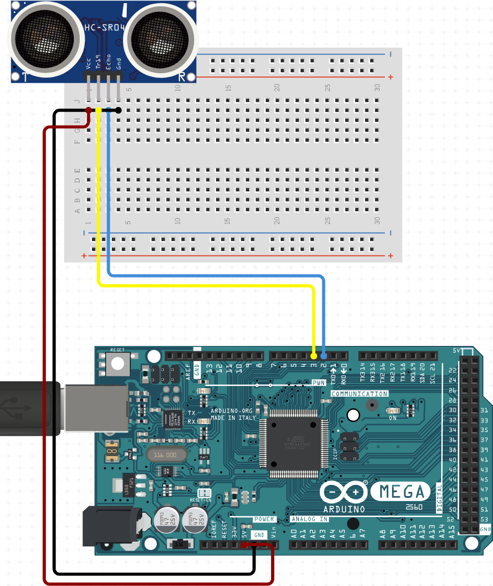
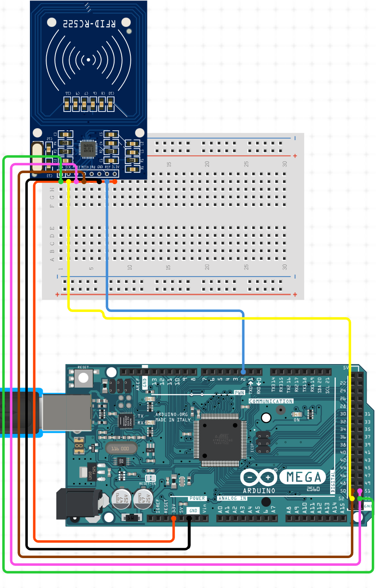
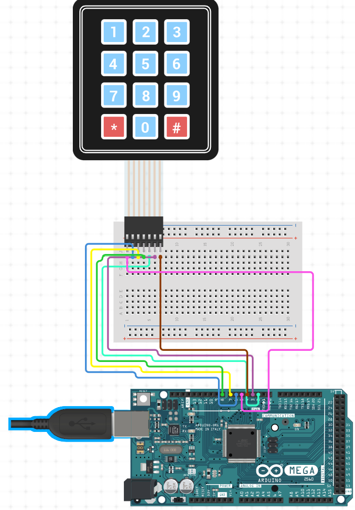
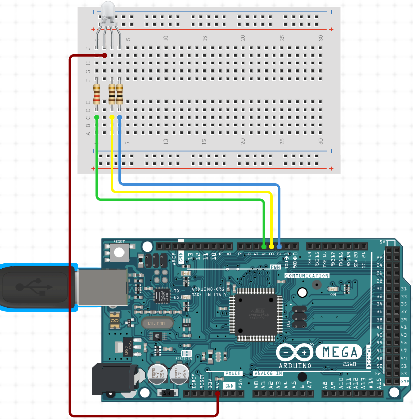
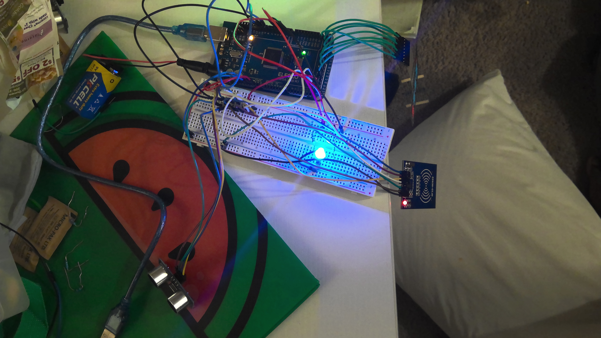

# mbayet.github.io
# Introduction

My name is Mbaye Toure ,and I am going to be a sophmore next year at wisdom Highschool in HTX . This summer I made a ultrasonic security system. My ultasonic security system how does it work and what does it do ? well let me tell you. 

 
# ultrasonic security system 
My ultrasonic system it detects how close someone is to my sensor when that hapens my light will turn off showing that it is detecting something, and if you are trying to access it you will have to put in the pasword and scan my rfid card.


# Arduino Mega 2560 R3
In this project I started by having my Arduino Mega 2560 R3 you guys are wondering how does it work well let me explain.The Arduino Mega 2560  R3 is what I like to call the brain,because it is basicly like a motherboard where everything is controlled,and where you connect your power .  


# Breadboard
After already having your arduino mega you will need a breadboard. A breadboard is where you can allow allow easy and quick creation of temporary electronic circuits or to carry out experiments with circuit.


# ultrasonic sensor
What is an ultrasonic sensor? An ultrasonic sensor is a sensor that  measures the distance to an object using ultrasonic sound waves. The first step you have to do to connect your sensor is that you have to know what a vcc,trig pin,echo pin,and  ground are. A vcc is the first needle that you will connect to a 5 volt then you can connect your echo pin, and trig pin wich are digital pins so you can conect them to any digital pin that you want. After you finish the trig and the echo you can proceed to connect  your ground because if don't connect your ground your sensor will not have power. I will put a picture and a code  so you guys can see how your sensor should look after you connect it.

```c++

```C++
#include "SR04.h"
#define TRIG_PIN 3
#define ECHO_PIN 2
SR04 sr04 = SR04(ECHO_PIN, TRIG_PIN);
long distance;
// This part is Identifying wich digital pins the trig and the are going into 
void setup() {
Serial.begin(9600);
/* Enable the SPI interface */
SPI.begin();
}
void loop() {
distance = sr04.Distance();
// We start with if distance is < 100
if (distance < 100) {
digitalWrite(BLUE, LOW);
//This section is telling the sensor that if someone is meters the blue light should turn on
// Serial.println("pls scan now");
}
}
```
# RFID

What is an RFID? An RFID is used to  to passively identify a tagged object. The way you can connect your rfid is that ther will be letters writen on your rfid and some of them will be digital pins then you will have to connect a 3.3 volt, and your ground because you need your ground for the rfid to work.
Here is a picture, and a code for the RFID.





```C++
/* Include the RFID library */
#include <RFID.h>
#define SDA_DIO 53
#define RESET_DIO 2
RFID RC522(SDA_DIO, RESET_DIO);
// This part is Identifying where the pins are located 
void setup() {
Serial.begin(9600);
/* Enable the SPI interface */
SPI.begin();
/* Initialise the RFID reader */
RC522.init();
}

void loop() {
if (RC522.isCard()) {
 /* If so then get its serial number */
String cardNumberScanned = "";
 RC522.readCardSerial();
 Serial.println("Card detected:");
for (int i = 0; i < 5; i++) {
// Serial.print(RC522.serNum[i], DEC);
cardNumberScanned.concat(RC522.serNum[i]);
}
 Serial.println();
 Serial.print("card Number: ");
 Serial.println(cardNumberScanned);
if (cardNumberScanned.compareTo("13646395236") == 0) {
if (enteredKey == '1') {
    digitalWrite(RED, LOW);
digitalWrite(GREEN, LOW);
digitalWrite(BLUE, LOW);
 delay(300);
digitalWrite(RED, LOW);
digitalWrite(GREEN, HIGH);
} else {
Serial.print("incorrect code: ");
 Serial.println(enteredKey);
digitalWrite(RED, LOW);
digitalWrite(GREEN, LOW);
 digitalWrite(BLUE, LOW);
delay(300);
digitalWrite(RED, HIGH);
digitalWrite(GREEN, LOW);
}

      } else {
digitalWrite(RED, LOW);
digitalWrite(GREEN, LOW);
digitalWrite(BLUE, LOW);
delay(300);
digitalWrite(RED, HIGH);
digitalWrite(GREEN, LOW);
Serial.println("no card incorrect");
}
Serial.println();
Serial.println();
}
} else {
digitalWrite(BLUE, HIGH);
}
```
  // This part of the code is where you set your lights voltage and also identify your card that you will be scaning 

 

# Keypad
What is a keypad? A keypad is like a mini keyboard with numbers and a couple of letters.The why you can connect your keypad is that there is eight dgital pin that you will need to connect to the first four will be for the rows and the last four will be for coloms. One thing is that it does not matter where you plug your digital pins .
Here is a picture and a code .



```C++
#include <Keypad.h>
//KeyPad begin setup
const byte ROWS = 4;  //four rows
const byte COLS = 4;  //four columns
//define the cymbols on the buttons of the keypads
char hexaKeys[ROWS][COLS] = {
{ '1', '2', '3', 'A' },
{ '4', '5', '6', 'B' },
{ '7', '8', '9', 'C' },
{ '*', '0', '#', 'D' }
};
byte rowPins[ROWS] = { 23, 27, 31, 35 };  //connect to the row pinouts of the keypad
byte colPins[COLS] = { 39, 43, 47, 24 };  //connect to the column pinouts of the keypad
Keypad customKeypad = Keypad(makeKeymap(hexaKeys), rowPins, colPins, ROWS, COLS);

//KeyPad end setup
char customKey = customKeypad.getKey();
char enteredKey = ' ';
void setup() {
//In this part you are identifying th digital pins for your keypad the rows and the coloms 
}
void loop() {

customKey = customKeypad.getKey();
if (customKey && enteredKey != customKey) {
Serial.println(customKey);
enteredKey = customKey;
}
if (customKey == 'D') {
Serial.print(distance);
Serial.println("cm");
}
}
// This part is telling the progam to print the distance when you press D wich is our custom key
```


                                                 

# RGB
What is an RGB? An RGB  emits different colors by mixing the 3 basic colors red, green and blue. The way you can connect your RGB is that you can connect it to your breadboard anywhere you want , but the is four needles and one of the needls is longer than the other one that needle is called a cathode then for the other three wires you can use resistors. For those who don't know what a resistor is I will talk about it in the next section.
Here is a picture and a code.



```C++
#define BLUE 2
#define GREEN 3
#define RED 4
// In this part we are identifying the digital pins for the RGB
void setup() {
  Serial.begin(9600);

pinMode(RED, OUTPUT);
pinMode(GREEN, OUTPUT);
pinMode(BLUE, OUTPUT);
digitalWrite(RED, LOW);
digitalWrite(GREEN, LOW);
digitalWrite(BLUE, LOW);
}
// in this part we seting our lights as outputs the seting them as low wich means low voltage 
void loop() {
digitalWrite(BLUE, LOW);
digitalWrite(RED, LOW);
digitalWrite(GREEN, LOW);
digitalWrite(BLUE, LOW);
delay(300);
digitalWrite(RED, LOW);
digitalWrite(GREEN, HIGH);
digitalWrite(RED, LOW);
digitalWrite(GREEN, LOW);
digitalWrite(BLUE, LOW);
delay(300);
digitalWrite(RED, HIGH);
digitalWrite(GREEN, LOW);
digitalWrite(RED, LOW);
// in the loop section we are seting our lights color voltage 
digitalWrite(GREEN, LOW);
digitalWrite(BLUE, LOW);
delay(300);
digitalWrite(RED, HIGh);
digitalWrite(GREEN, LOW);
digitalWrite(BLUE, HIGH);
}
``` 

# Resistors 
What is a resistor? A resistor reduces current flow, adjust signal levels, to divide voltages, bias active elements, and terminate transmission lines, among other uses. Another thing that you guys need to know is that there are two types namely linear resistor and non-linear resistor.
Here is a code and a  picture. 


# Picture
Here I have a picture of how my project turned out.





  # CODE


Here is where you guys  can use my code and make the same exact connection I made for this project . 

 ```c++
#include <SPI.h>
/* Include the RFID library */
#include <RFID.h>
#include "SR04.h"
#include <Keypad.h>

#define TRIG_PIN 10
#define ECHO_PIN 11
#define SDA_DIO 9
#define RESET_DIO 8
#define BLUE 4
#define GREEN 3
#define RED 2


//KeyPad begin setup
const byte ROWS = 4;  //four rows
const byte COLS = 4;  //four columns
//define the cymbols on the buttons of the keypads
char hexaKeys[ROWS][COLS] = {
  { '1', '2', '3', 'A' },
  { '4', '5', '6', 'B' },
  { '7', '8', '9', 'C' },
  { '*', '0', '#', 'D' }
};
byte rowPins[ROWS] = { 23, 27, 31, 35 };  //connect to the row pinouts of the keypad
byte colPins[COLS] = { 39, 43, 47, 24 };  //connect to the column pinouts of the keypad
Keypad customKeypad = Keypad(makeKeymap(hexaKeys), rowPins, colPins, ROWS, COLS);

//KeyPad end setup

RFID RC522(SDA_DIO, RESET_DIO);
SR04 sr04 = SR04(ECHO_PIN, TRIG_PIN);
long distance;
char customKey = customKeypad.getKey();
char enteredKey = ' ';
/* Define the DIO used for the SDA (SS) and RST (reset) pins. */
/*
PINOUT:
RC522 MODULE    Uno/Nano     MEGA
SDA             D10          D11
SCK             D13          D52
MOSI            D11          D51
MISO            D12          D50
IRQ             N/A          N/A
GND             GND          GND
RST             D9           D8
3.3V            3.3V         3.3V
*/

/* Create an instance of the RFID library */

void setup() {
Serial.begin(9600);
/* Enable the SPI interface */
SPI.begin();
/* Initialise the RFID reader */
RC522.init();

pinMode(RED, OUTPUT);
pinMode(GREEN, OUTPUT);
pinMode(BLUE, OUTPUT);
digitalWrite(RED, LOW);
digitalWrite(GREEN, LOW);
digitalWrite(BLUE, LOW);
}

void loop() {
distance = sr04.Distance();
// We start with if distance is < 100
if (distance < 100) {
digitalWrite(BLUE, LOW);
// Serial.println("pls scan now");
if (RC522.isCard()) {
/* If so then get its serial number */
String cardNumberScanned = "";
RC522.readCardSerial();
Serial.println("Card detected:");
for (int i = 0; i < 5; i++) {
// Serial.print(RC522.serNum[i], DEC);
cardNumberScanned.concat(RC522.serNum[i]);
}
Serial.println();
 Serial.print("card Number: ");
 serial.println(cardNumberScanned);
if (cardNumberScanned.compareTo("13646392239") == 0) {
if (enteredKey == '1') {
digitalWrite(RED, LOW);
digitalWrite(GREEN, LOW);
digitalWrite(BLUE, LOW);
delay(300);
digitalWrite(RED, LOW);
digitalWrite(GREEN, HIGH);
} else {
Serial.print("incorrect code: ");
Serial.println(enteredKey);
digitalWrite(RED, LOW);
digitalWrite(GREEN, LOW);
digitalWrite(BLUE, LOW);
delay(300);
digitalWrite(RED, HIGH);
digitalWrite(GREEN, LOW);
}

} else {
digitalWrite(RED, LOW);
digitalWrite(GREEN, LOW);
digitalWrite(BLUE, LOW);
 delay(300);
digitalWrite(RED, HIGH);
digitalWrite(GREEN, LOW);
Serial.println("no card incorrect");
}
Serial.println();
Serial.println();
}
} else {
digitalWrite(BLUE, HIGH);
}
/* Has distance card been detected? */
customKey = customKeypad.getKey();
if (customKey && enteredKey != customKey) {
Serial.println(customKey);
enteredKey = customKey;
}
if (customKey == 'D') {
Serial.print(distance);
Serial.println("cm");
}
}
``````
# tools

you can use this link to buy an arduino kit so you can make this project.

[here](https://www.amazon.com/EL-KIT-008-Project-Complete-Ultimate-TUTORIAL/dp/B01EWNUUUA/ref=asc_df_B01EWNUUUA/?tag=hyprod-20&linkCode=df0&hvadid=309779531175&hvpos=&hvnetw=g&hvrand=12878185721675954885&hvpone=&hvptwo=&hvqmt=&hvdev=c&hvdvcmdl=&hvlocint=&hvlocphy=9033313&hvtargid=pla-587465714317&psc=1&tag=&ref=&adgrpid=62412137260&hvpone=&hvptwo=&hvadid=309779531175&hvpos=&hvnetw=g&hvrand=12878185721675954885&hvqmt=&hvdev=c&hvdvcmdl=&hvlocint=&hvlocphy=9033313&hvtargid=pla-587465714317)


  


 

 