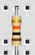

# mbayet.github.io
# Introduction

My name is Mbaye Toure ,and I am going to be a sophmore next year at wisdom Highschool in HTX . This summer I made a ultrasonic security system. My ultasonic security system how does it work and what does it do ? well let me tell you. 

 
# ultrasonic security system 
My ultrasonic system it detects how close someone is to my sensor when that hapens my light will turn off showing that it is detecting something, and if you are trying to access it you will have to put in the pasword and scan my rfid card.


# Arduino Mega 2560 R3
In this project I started by having my Arduino Mega 2560 R3 you guys are wondering how does it work well let me explain.The Arduino Mega 2560  R3 is what I like to call the brain,because it is basicly like a motherboard where everything is controlled,and where you connect your power .  


# Breadboard
After already having your arduino mega you will need a breadboard.A breadboard is where you can allow allow easy and quick creation of temporary electronic circuits or to carry out experiments with circuit.


# ultrasonic sensor
What is an ultrasonic sensor? An ultrasonic sensor is a sensor that  measures the distance to an object using ultrasonic sound waves. The first step you have to do to connect your sensor is that you have to know what a vcc,trig pin,echo pin,and  ground are. A vcc is the first needle that you will connect to a 5 volt then you can connect your echo pin, and trig pin wich are digital pins so you can conect them to any digital pin that you want. After you finish the trig and the echo you can proceed to connect  your ground because if don't connect your ground your sensor will not have power. I will put a picture so you guys can see how your sensor should look after you connect it.

```c++
// Include Libraries
#include "Arduino.h"
#include "NewPing.h"


// Pin Definitions
#define HCSR04_PIN_TRIG	3
#define HCSR04_PIN_ECHO	2


// Global variables and defines

// object initialization
NewPing hcsr04(HCSR04_PIN_TRIG,HCSR04_PIN_ECHO);


// define vars for testing menu
const int timeout = 10000;       //define timeout of 10 sec
char menuOption = 0;
long time0;

// Setup the essentials for your circuit to work. It runs first every time your circuit is powered with electricity.
void setup() 
{
    // Setup Serial which is useful for debugging
    // Use the Serial Monitor to view printed messages
    Serial.begin(9600);
    while (!Serial) ; // wait for serial port to connect. Needed for native USB
    Serial.println("start");
    
    
    menuOption = menu();
    
}

// Main logic of your circuit. It defines the interaction between the components you selected. After setup, it runs over and over again, in an eternal loop.
void loop()
```

# RFID
What is an RFID? An RFID is used to  to passively identify a tagged object. The way you can connect your rfid is that ther will be letters writen on your rfid and some of them will be digital pins then you will have to connect a 3.3 volt, and your ground because you need your ground for the rfid to work.
Here is a picture you can use so you can connect your rfid.


# Keypad
What is a keypad? A keypad is like a mini keyboard with numbers and a couple of letters.The wsy you can connect your keypad is that there is eight dgital pin that you will need to connect to the first four will be for the rows and the last four will be for coloms. One thing is that it does not matter where you plug your digital pins .
Here is a picture so you guys can see how I connected mine.


                                                 
  # RGB
What is an RGB? An RGB  emits different colors by mixing the 3 basic colors red, green and blue. The way you can connect your RGB is that you can connect it to your breadboard anywhere you want , but the is four needles and one of the needls is longer than the other one that needle is called a cathode then for the other three wires you can use resistors. For those who don't know what a resistor is I will talk about it in the next section .
Here is a picture so you guys can see how it looks after you connect your RGB .


# Resistors 
What is a resistor? A resistor reduces current flow, adjust signal levels, to divide voltages, bias active elements, and terminate transmission lines, among other uses. Another thing that you guys need to know is that there are two types namely linear resistor and non-linear resistor.
Here is a picture of how  a resistor look .





  # CODE
  ```c++
// Include Libraries
#include "Arduino.h"
#include "NewPing.h"
#include "Keypad.h"
#include "RFID.h"
#include "RGBLed.h"
#include "Button.h"


// Pin Definitions
#define HCSR04_PIN_TRIG	6
#define HCSR04_PIN_ECHO	5
#define KEYPADMEM3X4_PIN_ROW1	10
#define KEYPADMEM3X4_PIN_ROW2	11
#define KEYPADMEM3X4_PIN_ROW3	12
#define KEYPADMEM3X4_PIN_ROW4	13
#define KEYPADMEM3X4_PIN_COL1	7
#define KEYPADMEM3X4_PIN_COL2	8
#define KEYPADMEM3X4_PIN_COL3	9
#define RFID_PIN_RST	14
#define RFID_PIN_SDA	53
#define RGBLED_PIN_B	2
#define RGBLED_PIN_G	3
#define RGBLED_PIN_R	4
#define SLIDESWITCH_PIN_2	15


// Global variables and defines
//Use this 2D array to map the keys as you desire
char keypadmem3x4keys[ROWS][COLS] = {
{'1','2','3'},
{'4','5','6'},
{'7','8','9'},
{'*','0','#'}
};
#define rgbLed_TYPE COMMON_ANODE
// object initialization
NewPing hcsr04(HCSR04_PIN_TRIG,HCSR04_PIN_ECHO);
Keypad keypadmem3x4(KEYPADMEM3X4_PIN_COL1,KEYPADMEM3X4_PIN_COL2,KEYPADMEM3X4_PIN_COL3,KEYPADMEM3X4_PIN_ROW1,KEYPADMEM3X4_PIN_ROW2,KEYPADMEM3X4_PIN_ROW3,KEYPADMEM3X4_PIN_ROW4);
RFID rfid(RFID_PIN_SDA,RFID_PIN_RST);
RGBLed rgbLed(RGBLED_PIN_R,RGBLED_PIN_G,RGBLED_PIN_B,rgbLed_TYPE);
Button slideSwitch(SLIDESWITCH_PIN_2);


// define vars for testing menu
const int timeout = 10000;       //define timeout of 10 sec
char menuOption = 0;
long time0;

// Setup the essentials for your circuit to work. It runs first every time your circuit is powered with electricity.
void setup() 
{
    // Setup Serial which is useful for debugging
    // Use the Serial Monitor to view printed messages
    Serial.begin(9600);
    while (!Serial) ; // wait for serial port to connect. Needed for native USB
    Serial.println("start");
    
    //Initialize the keypad with selected key map
    keypadmem3x4.begin(keypadmem3x4keys);
    //initialize RFID module
    rfid.init();
    rgbLed.turnOff();              // Start with  LED Strip RGB turned off
    slideSwitch.init();
    menuOption = menu();
    
}

// Main logic of your circuit. It defines the interaction between the components you selected. After setup, it runs over and over again, in an eternal loop.
void loop() 
{
    
    
    if(menuOption == '1') {
    // Ultrasonic Sensor - HC-SR04 - Test Code
    // Read distance measurment from UltraSonic sensor           
    int hcsr04Dist = hcsr04.ping_cm();
    delay(10);
    Serial.print(F("Distance: ")); Serial.print(hcsr04Dist); Serial.println(F("[cm]"));

    }
    else if(menuOption == '2') {
    // Membrane 3x4 Matrix Keypad - Test Code
    //Read keypad
    char keypadmem3x4Key = keypadmem3x4.getKey();
    if (isDigit(keypadmem3x4Key) ||  keypadmem3x4Key == '*' ||  keypadmem3x4Key == '#')
    {
    Serial.print(keypadmem3x4Key);
    }
    }
    else if(menuOption == '3') {
    // RFID Card Reader - RC522 - Test Code
    //Read RFID tag if present
    String rfidtag = rfid.readTag();
    //print the tag to serial monitor if one was discovered
    rfid.printTag(rfidtag);

    }
    else if(menuOption == '4') {
    // RGB Led Common Anode - Test Code
    // The RGB LED will turn PURPLE for 500ms(half a second) and turn off
    rgbLed.setRGB(160, 3, 255);    // 1. sets RGB LED color to purple. Change the values in the brackets to (255,0,0) for pure RED, (0,255,0) for pure GREEN and (0,0,255) for pure BLUE.
    delay(500);                         // 2. change the value in the brackets (500) for a longer or shorter delay in milliseconds.
    rgbLed.setRGB(0, 0, 0);        // 3. turns RGB LED off (showing no color). Change the values in the brackets to alter the color.
    delay(500);                         // 4. change the value in the brackets (500) for a longer or shorter delay in milliseconds.  
    }
    else if(menuOption == '5') {
    // SPDT Slide Switch (Breadboard-friendly) - Test Code
    //read Slide Switch state. 
    //if Switch is open function will return LOW (0). 
    //if it is closed function will return HIGH (1).
    bool slideSwitchVal = slideSwitch.read();
    Serial.print(F("Val: ")); Serial.println(slideSwitchVal);
    }
    
    if (millis() - time0 > timeout)
    {
        menuOption = menu();
    }
    
}


// Menu function for selecting the components to be tested
// Follow serial monitor for instrcutions
char menu()
{

    Serial.println(F("\nWhich component would you like to test?"));
    Serial.println(F("(1) Ultrasonic Sensor - HC-SR04"));
    Serial.println(F("(2) Membrane 3x4 Matrix Keypad"));
    Serial.println(F("(3) RFID Card Reader - RC522"));
    Serial.println(F("(4) RGB Led Common Anode"));
    Serial.println(F("(5) SPDT Slide Switch (Breadboard-friendly)"));
    Serial.println(F("(menu) send anything else or press on board reset button\n"));
    while (!Serial.available());

    // Read data from serial monitor if received
    while (Serial.available()) 
    {
        char c = Serial.read();
        if (isAlphaNumeric(c)) 
        {   
            
            if(c == '1') 
    			Serial.println(F("Now Testing Ultrasonic Sensor - HC-SR04"));
    		else if(c == '2') 
    			Serial.println(F("Now Testing Membrane 3x4 Matrix Keypad"));
    		else if(c == '3') 
    			Serial.println(F("Now Testing RFID Card Reader - RC522"));
    		else if(c == '4') 
    			Serial.println(F("Now Testing RGB Led Common Anode"));
    		else if(c == '5') 
    			Serial.println(F("Now Testing SPDT Slide Switch (Breadboard-friendly)"));
            else
            {
                Serial.println(F("illegal input!"));
                return 0;
            }
            time0 = millis();
            return c;
        }
    }
}
```


# tools

you can use this link to buy an arduino kit so you can make this project.

[here](https://www.amazon.com/EL-KIT-008-Project-Complete-Ultimate-TUTORIAL/dp/B01EWNUUUA/ref=asc_df_B01EWNUUUA/?tag=hyprod-20&linkCode=df0&hvadid=309779531175&hvpos=&hvnetw=g&hvrand=12878185721675954885&hvpone=&hvptwo=&hvqmt=&hvdev=c&hvdvcmdl=&hvlocint=&hvlocphy=9033313&hvtargid=pla-587465714317&psc=1&tag=&ref=&adgrpid=62412137260&hvpone=&hvptwo=&hvadid=309779531175&hvpos=&hvnetw=g&hvrand=12878185721675954885&hvqmt=&hvdev=c&hvdvcmdl=&hvlocint=&hvlocphy=9033313&hvtargid=pla-587465714317)


  


 

 